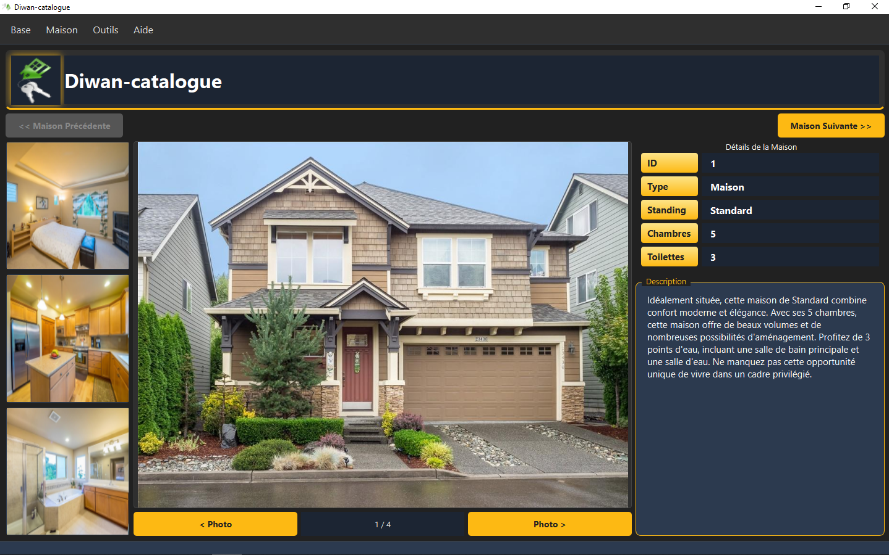
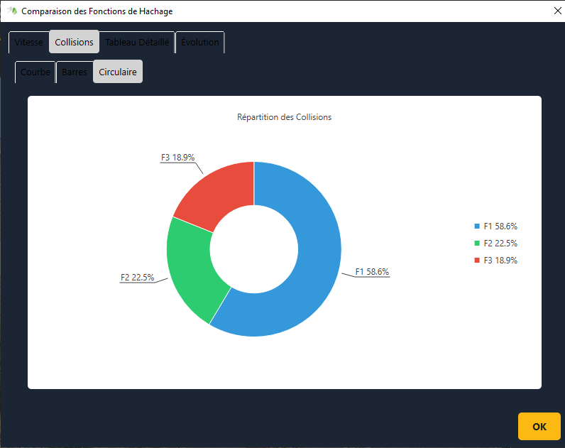
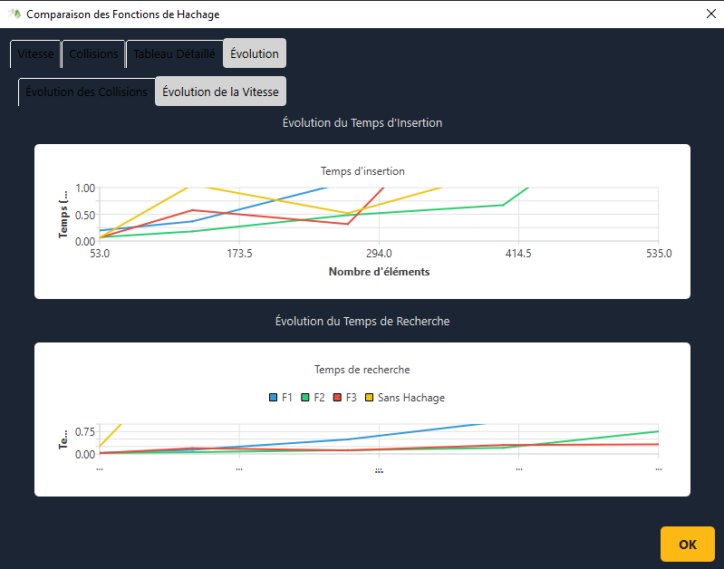
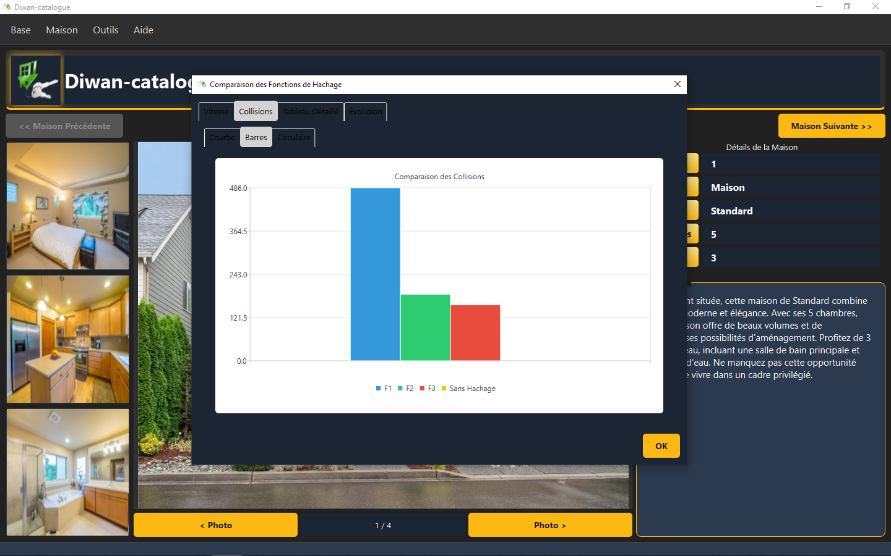

# Diwan-catalogue

**Diwan-catalogue** est une application Qt 6.9 moderne pour la gestion de maisons, avec analyse de performance de fonctions de hachage et visualisation graphique.

## Fonctionnalités principales
- Gestion de maisons (ajout, suppression, recherche, navigation)
- 4 photos par maison (2 intérieures, 2 extérieures)
- Table de hachage avec 3 fonctions (f1, f2, f3) + mode sans hachage
- Analyse de performance (QElapsedTimer, export CSV/JSON)
- Visualisation des courbes avec Qt Charts
- Interface moderne : thème sombre, glassmorphisme, menus Windows

## Installation
1. **Qt 6.9** (Qt Creator recommandé)
2. **Python 3.x** (pour générer la base de données)

## Génération de la base de données
```bash
cd data
python generate_maison_db.py
```

## Compilation et exécution
- **Avec Qt Creator** :
  1. Ouvrir `Diwan-catalogue.pro`
  2. Sélectionner un kit Qt 6.9
  3. Compiler et exécuter
- **Avec CMake** :
  ```bash
  mkdir build && cd build
  cmake ..
  cmake --build .
  ./GestionImmobiliere
  ```

## Structure du projet
```
/src         – sources C++
/images      – 4 photos par maison
/data        – maison.db, script Python, SQL
/docs        – README, justifications, captures UI
/build       – fichiers générés
```

## Interface graphique
- Menu Windows : Base, Maison, FonctionHachage, Courbes, Aide, Quitter
- Zone photo (navigation Précédent/Suivant)
- Style sombre et glassmorphique

## Logique métier
- TableHachage (chaînage linéaire)
- Fonctions de hachage f1, f2, f3
- Persistance SQLite
- Export CSV/JSON
- Courbes Qt Charts

## Auteurs
- Adaptation et refonte : [Votre nom]
- Projet d'origine : https://github.com/alimar440/TurboSearch

## Captures d'écran

### Présentation générale


### Diagramme circulaire (statistiques)


### Évolution des performances de hachage


### Graphique en barres comparatif



## Fonctionnement de l’application

1. **Accueil / Navigation**  
   L’utilisateur accède à la liste des maisons, peut naviguer, rechercher ou filtrer les biens immobiliers.

2. **Ajout/Suppression/Modification**  
   Possibilité d’ajouter une nouvelle maison, de modifier ses informations ou de la supprimer. Chaque maison peut être illustrée par 4 photos (2 intérieures, 2 extérieures).

3. **Gestion de la table de hachage**  
   L’utilisateur peut choisir entre plusieurs fonctions de hachage (f1, f2, f3) pour stocker les maisons, ou utiliser un mode sans hachage. Les performances (collisions, temps d’accès) sont analysées et visualisées.

4. **Analyse et visualisation graphique**  
   Les résultats des analyses sont affichés sous forme de graphiques (courbes, diagrammes circulaires, barres) grâce à Qt Charts.

5. **Export des données**  
   Les données et résultats peuvent être exportés en CSV ou JSON pour une exploitation externe.

6. **Interface moderne**  
   L’application propose un thème sombre, un effet glassmorphisme et une navigation intuitive via des menus inspirés de Windows.


Trouvez rapidement des voitures par matricule.

### Suppression


Supprimez des enregistrements de voitures par matricule.

### Affichage


Visualisez la liste des voitures enregistrées.


## Installation

1. Clonez le dépôt :
   ```sh
   git clone https://github.com/alimar440/turbosearch.git
